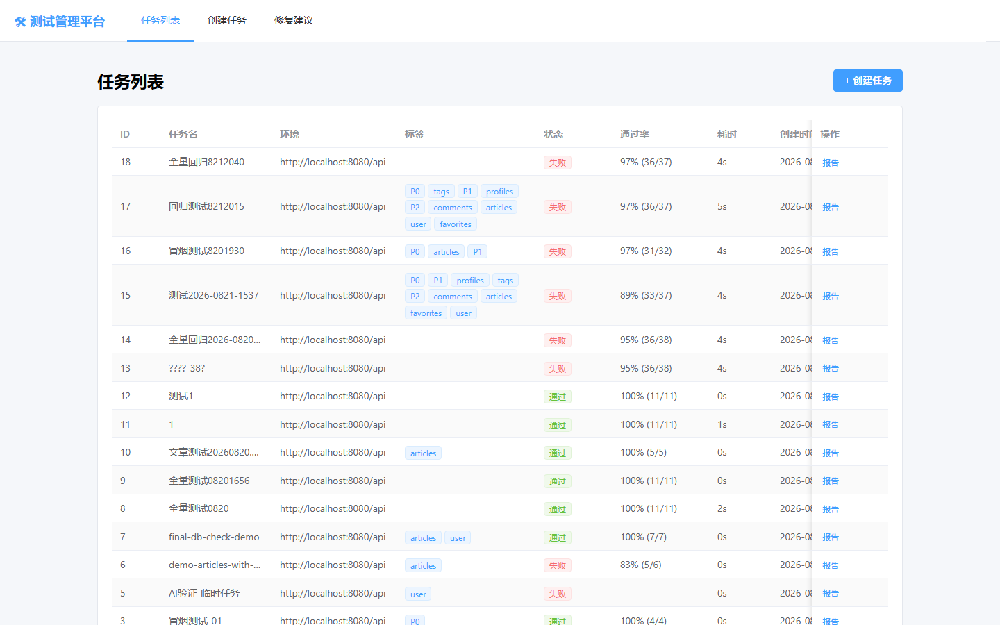
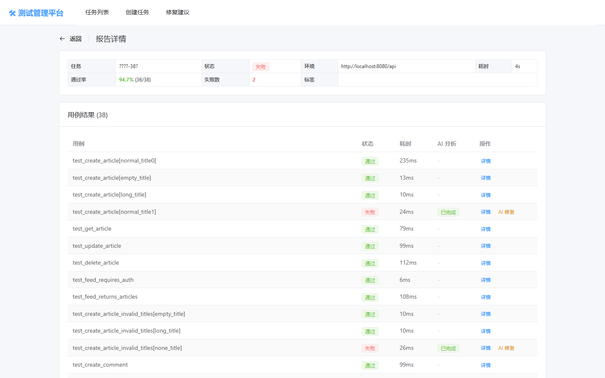
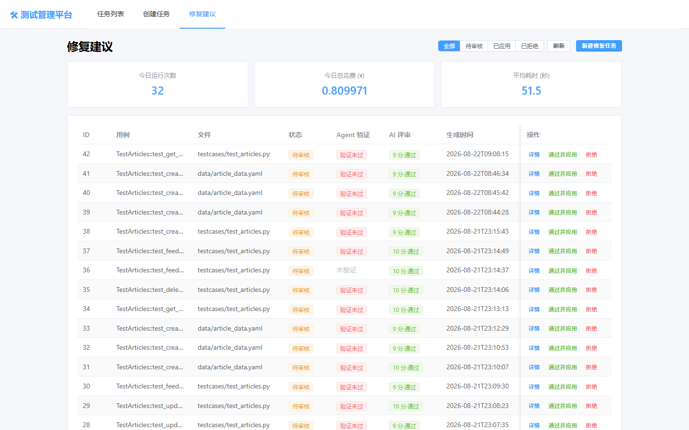

# TestMind — AI 测试管理平台(自愈式用例修复 Agent)

> FastAPI + Vue3 + 通义千问构建的接口测试管理平台,内置 **ReAct 模式 Auto-Fix Agent**:失败用例自动分析根因、生成最小修复补丁、回归验证,并经人工审核后应用——**60 场景故障注入评估修复成功率 100%**。

配 GitHub Actions 徽章位(可自行替换):


---

## 核心亮点(30 秒版)

| # | 亮点 | 实测数据 |
|---|---|---|
| 1 | **自愈式 Auto-Fix Agent**(ReAct + function calling):失败用例 → 取证 → 生成 unified diff 补丁 → 整文件回归验证 → PASSED 早停 | 单次修复平均 45s,成本 <¥0.01 |
| 2 | **故障注入式评估体系**:60 场景(字段变更/断言错误/超时/环境抖动×15),以"补丁真实应用后用例通过"为成功标准 | **修复成功率 60/60 = 100%**,环境类失败 30 例零误修复 |
| 3 | **RAG 修复记忆**:chromadb 向量库沉淀历史修复案例,新失败自动检索 Top-3 作 Few-shot,越修越有经验 | 相似案例检索实测命中(余弦相似度 57%+) |
| 4 | **LLM-as-judge 双评审**:独立"评审员"审安全性(骗绿一票否决)/最小性/正确性,作者与评审分离 | 实测补丁评 10 分 approve,评语覆盖三维度 |
| 5 | **全链路可观测**:ReAct 每轮思考落库,SSE 实时思考流前端逐轮观看,基于轨迹的流式追问("为什么这样改?") | 累计 900+ 条轨迹,12 事件 SSE 流实测收尾 |
| 6 | **工程韧性**:tenacity 指数退避重试 + filelock 文件锁(覆盖"替换→验证→还原"全程);RAG/计费/评审/看板全降级,旁路故障不崩主流程 | 两线程并发持锁区间实测零重叠 |
| 7 | **模型无关架构**:LLM 入口/模型/计价均由 `.env` 配置,兼容一切 OpenAI 兼容协议模型 | qwen-plus → qwen3.8-max 一键切换,零代码改动 |

## 平台运行效果

### 任务列表 — 测试任务管理(状态/通过率/耗时)



### 测试报告 — 失败用例一键「AI 修复」



### 修复建议审核台 — 成本看板 / 补丁列表 / AI 评审列



> 以上为本仓库真实运行抓取的截图。提交修复任务后,前端还会弹出 **Agent 实时思考流窗口**(SSE 终端风格,逐轮展示 ReAct 思考与工具调用),补丁详情抽屉内可点「问 Agent」进行基于轨迹的流式追问——此二者为动态交互,建议 clone 后亲自体验。

---

## 系统架构

```
┌─────────────────────────────────────────────────────────────────┐
│                     前端 Vue3 + Element Plus (5173)               │
│  任务管理 │ 测试报告(失败行一键AI修复) │ 修复审核台 │ 成本看板     │
│  Agent实时思考流(SSE) │ 问Agent流式对话 │ LLM评审展示              │
└────────────────────────────┬────────────────────────────────────┘
                             │ /api (Vite 代理)
┌────────────────────────────▼────────────────────────────────────┐
│                    后端 FastAPI (8000)                            │
│                                                                  │
│  ┌──────────────┐  ┌─────────────────────────────────────────┐  │
│  │ 任务执行器    │  │        Auto-Fix Agent (ReAct)           │  │
│  │ executor.py  │  │  agent.py   思考-行动-观察循环(≤7轮)     │  │
│  │ subprocess   │  │  tools.py   4工具: git_diff/read_file/  │  │
│  │ 跑项目一真实  │  │             generate_patch/run_pytest   │  │
│  │ pytest用例   │  │  judge.py   LLM-as-judge 补丁评审       │  │
│  │ junitxml解析 │  │  memory.py  RAG记忆(chromadb向量检索)   │  │
│  │ +AI根因分析  │  │  review.py  人工审核落盘(文件锁保护)     │  │
│  └──────┬───────┘  └──────────────┬──────────────────────────┘  │
│         │                         │                              │
│  ┌──────▼─────────────────────────▼──────────────────────────┐  │
│  │                    MySQL (8 张表)                          │  │
│  │  test_tasks / test_case_results / fix_suggestions         │  │
│  │  eval_cases / agent_trajectories / agent_costs ...        │  │
│  └───────────────────────────────────────────────────────────┘  │
└────────────────────────────┬────────────────────────────────────┘
                             │ subprocess(带 BASE_URL 注入)
┌────────────────────────────▼────────────────────────────────────┐
│        项目一 pytest-realworld-framework(被测用例源)              │
│        testcases/ 38 条数据驱动用例(YAML+fixture)                │
└────────────────────────────┬────────────────────────────────────┘
                             │ HTTP
                    被测后端 RealWorld (8080)
```

## Auto-Fix Agent 工作流

```
失败用例提交 ──► RAG检索Top-3相似历史案例(Few-shot) ──► ReAct循环(最多7轮)
                                                            │
              ┌─────────────────────────────────────────────┤
              ▼                                             ▼
        Thought(通义千问推理)                        generate_patch
              │                                      (原文唯一性校验)
              ▼                                             │
        Action: get_git_diff / read_file          ┌─────────▼──────────┐
              │                                   │ LLM-as-judge 评审  │
              ▼                                   │ (安全性一票否决)   │
        Observation(工具结果回填)                  └─────────┬──────────┘
              │                                             ▼
              └──────► 循环直到补丁验证                run_pytest(patch_id)
                                                       文件锁全程保护:
                                                    临时替换→整文件回归→还原
                                                             │
                                              PASSED ────────┴──── 未通过
                                                │                    │(读错误再修)
                                          早停+写RAG记忆         继续循环
                                                │
                                                ▼
                                    fix_suggestions(pending_review)
                                                │
                                    人工审核:通过落盘 / 拒绝 / 问Agent
```

## 评估体系(可信度来自数据)

**评估方法——故障注入式,非文本相似度**:

1. 自动把"正确代码"替换为"故障代码"(KeyError/错误状态码/超时日志等)
2. 预检:确认注入后用例真实失败(不失败则场景无效)
3. Agent 修复 → 取其补丁**真实应用**到源文件 → 重跑用例
4. 用例通过才算修复成功(比"生成了补丁"严格得多)

**最终成绩(60 场景)**:

| 错误类型 | 场景数 | 成功率 | 考察能力 |
|---|---|---|---|
| field_change 字段变更 | 15 | **100%** | KeyError/AttributeError/NameError 修复 |
| assertion_error 断言错误 | 15 | **100%** | 期望值/逻辑级断言错误修复 |
| timeout 超时 | 15 | **100%** | 识别环境问题,**克制不改代码** |
| env_jitter 环境抖动 | 15 | **100%** | 502/SSL/DNS/代理等 15 形态零误修复 |
| **总体** | **60** | **100%** | 修复类 30/30 + 环境类 30/30 零误伤 |

**模型能力量化实证**:唯一 qwen-plus 无法修复的案例(逻辑级断言错误 #20),qwen3.8-max 一次修复成功——评估体系直接支撑了模型选型决策。

复现评估:

```powershell
cd backend
python cli/init_eval_data.py    # 生成 60 条评估场景(含锚点预检)
python cli/run_eval.py          # 全量评估 → eval_report.json
```

## 技术栈

| 层级 | 技术 | 用途 |
|---|---|---|
| 前端 | Vue 3 + Vite + Element Plus | SPA / 组件库 |
| 前端 | EventSource(SSE) / fetch stream | 实时思考流 / 流式对话 |
| 后端 | FastAPI + Uvicorn + SQLAlchemy 2.x | Web / ORM |
| 后端 | BackgroundTasks + subprocess | 异步任务 / 驱动 pytest |
| Agent | openai SDK(兼容模式) + function calling | 通义千问 qwen3.8-max |
| 韧性 | tenacity / filelock | 指数退避重试 / 跨进程文件锁 |
| RAG | chromadb(本地持久化, cosine) | 修复记忆向量检索 |
| 数据 | MySQL 8 张表 | 任务/结果/补丁/轨迹/成本/评估 |

## 项目结构

```
test-management-platform/
├── backend/
│   ├── app/
│   │   ├── agent/                  # ★ Auto-Fix Agent 模块(1600+ 行)
│   │   │   ├── agent.py            #   ReAct 循环 + 早停 + 轨迹埋点 + 计费拦截
│   │   │   ├── tools.py            #   4 工具 + OpenAI Schema + 文件锁
│   │   │   ├── judge.py            #   LLM-as-judge 补丁评审
│   │   │   ├── memory.py           #   RAG 记忆(chromadb,全降级)
│   │   │   ├── db.py               #   4 张 Agent 表 + 异步写入
│   │   │   ├── review.py           #   人工审核落盘(锁保护)
│   │   │   ├── config.py / models.py
│   │   ├── routers/
│   │   │   ├── tasks.py            # 任务 CRUD/报告
│   │   │   ├── fixes.py            # 触发修复/建议列表/审核
│   │   │   └── agent.py            # SSE思考流 / 问Agent / 成本看板
│   │   └── services/               # executor(38条用例)/allure解析/AI根因
│   ├── cli/
│   │   ├── init_eval_data.py       # 60 条评估场景生成(锚点预检)
│   │   └── run_eval.py             # 故障注入式评估(真值验证)
│   ├── check_integration.py        # 部署验收(6项彩色彩打)
│   └── requirements.txt
├── frontend/src/
│   ├── views/TaskList.vue          # 任务列表
│   ├── views/CreateTask.vue        # 创建任务(标签→pytest -m)
│   ├── views/ReportDetail.vue      # 报告(失败行"AI修复"入口)
│   └── views/FixSuggestions.vue    # 审核台+看板+SSE窗口+问Agent
└── docs/screenshots/               # 运行截图
```

## 快速开始

### 环境要求

Python 3.10+ / Node 18+ / MySQL 8 / 被测后端([pytest-realworld-framework](https://github.com/hjx666hero/pytest-realworld-framework) 的 docker-compose 提供RealWorld+MySQL)

### 1. 启动被测环境

```powershell
cd F:\pytest-realworld-framework
docker compose up -d --build      # RealWorld 后端(8080) + MySQL(3307)
```

### 2. 配置并启动后端

```powershell
cd backend
copy .env.example .env
# 编辑 .env:数据库 / PYTEST_FRAMEWORK_PATH / DASHSCOPE_API_KEY
# 模型可切换: TMS_AI_MODEL / TMS_AI_BASE_URL / 计价 TMS_AI_PRICE_*
pip install -r requirements.txt   # 含 openai/tenacity/filelock/chromadb
python run.py                     # http://127.0.0.1:8000,自动建库建表
```

### 3. 启动前端

```powershell
cd frontend
npm install
npm run dev                       # http://localhost:5173
```

### 4. 体验 Agent 自愈

1. 「创建任务」跑全量 38 条用例(或手工在项目一 `testcases/` 构造失败)
2. 报告页失败用例点 **「AI 修复」** → 提交
3. **实时思考流窗口**:逐轮观看 Agent 取证/生成补丁/回归验证
4. 「修复建议」页:看板(今日运行/花费/耗时)→ 补丁详情(diff/AI评审)→ **「问 Agent」**追问 → 通过落盘或拒绝

### 5. 部署验收

```powershell
cd backend && python check_integration.py   # 6 项检查,彩色彩打
```

## API 一览

| 方法 | 路径 | 说明 |
|---|---|---|
| POST | `/api/fixes/auto-fix` | 触发 Agent 修复(返回 trace_id 供 SSE 订阅) |
| GET | `/api/fixes/suggestions` | 修复建议列表(状态/用例过滤) |
| PATCH | `/api/fixes/suggestions/{id}` | 人工审核 applied/rejected(锁保护落盘) |
| GET | `/api/agent/trace/{id}/events` | **SSE 实时思考流** |
| POST | `/api/agent/ask` | 基于轨迹的流式追问 |
| GET | `/api/agent/stats` | 成本看板(运行次数/花费/耗时) |
| POST | `/api/tasks` | 创建测试任务(异步) |
| GET | `/api/tasks/{id}/report` | 报告详情 |

交互式文档:`http://127.0.0.1:8000/docs`

## 设计要点

1. **Agent 只建议不修改**:补丁一律 `pending_review` 入库,人工批准才落盘;验证采用"备份→临时替换→运行→还原"模式,全程文件锁防并发交错
2. **回归感知验证**:补丁验证跑整个测试文件而非单条用例——修复 A 弄坏 B 会被检出,`verified` 只有整文件全过才为 True
3. **作者/评审分离**:generate_patch(Agent)与 judge(评审员)是两个独立 LLM 角色,防自说自话;骗绿(删断言/跳测试)一票否决
4. **旁路全降级**:RAG/计费/评审/看板任一故障只记日志,绝不影响修复主流程——"可观测性不能拖垮可用性"
5. **模型无关**:`.env` 切换模型/入口/计价即可接入任意 OpenAI 兼容模型(DeepSeek/Kimi/GLM 等)

## 后续优化方向

| 方向 | 说明 | 优先级 |
|---|---|---|
| **AST 级补丁** | 现为字符串替换级,升级为 AST 定位+跨文件修改,支持复杂重构 | 高 |
| **多 Agent 协作** | 复杂故障引入 Planner-Worker 架构(拆解→并行修复→合并验证) | 高 |
| **评估集扩充** | 60 → 200+ 场景,引入真实历史故障回放(从 git 历史挖 case) | 中 |
| **主动降级模型** | 简单故障自动路由到小模型(qwen-turbo),复杂才用 max,成本再降 70% | 中 |
| **定时回归任务** | 平台定时跑全量,新失败自动进 Agent 队列,形成无人值守自愈环 | 中 |
| **CI/CD 集成** | GitHub Actions 失败用例自动注入 Agent,PR 内直接贴修复建议 | 中 |
| **WebSocket 推送** | SSE → WebSocket,支持双向(前端中途干预 Agent,如"换个思路") | 低 |
| **补丁冲突检测** | 多补丁排队审核时检测相互冲突(同文件同区域),提示人工 | 低 |

## 关联项目

- [pytest-realworld-framework](https://github.com/hjx666hero/pytest-realworld-framework):被测接口自动化框架(四层架构/数据驱动/DB 校验/CI/压测),提供本平台执行的 38 条用例

## License

MIT
